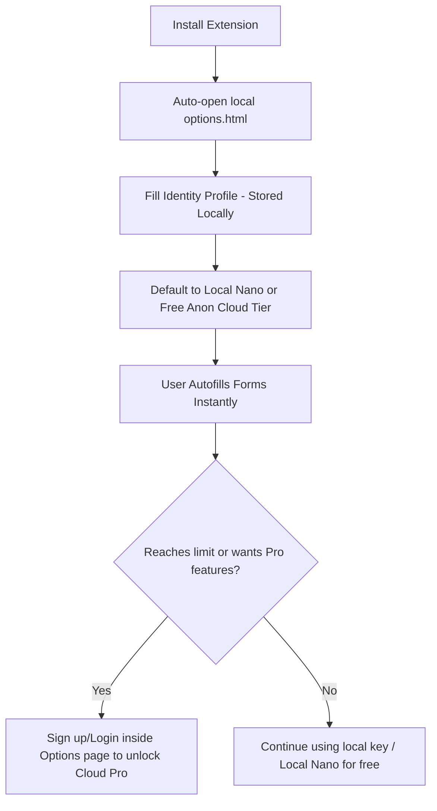

# AutoFill AI - User Flow and Onboarding Architecture

This document describes the onboarding and execution flow of the AutoFill AI Chrome extension.

## Onboarding & Authentication Flow

---

## Detailed Onboarding Phases

### Phase 1: Installation & Options Auto-Open
1. Upon installation, the background service worker ([background.ts](file:///home/user/Private_View/Vinay/DummyDataFiller/src/background/background.ts)) detects the installation event.
2. It programmatically opens the local [options.html](file:///home/user/Private_View/Vinay/DummyDataFiller/options.html) page in a new browser tab.
3. The options page reads the query parameter `?onboarding=true` and launches the multi-step onboarding wizard:
    *   **Walkthrough Screen (Step 1):** Explains how the extension works and introduces the 4 fill personas using an interactive simulated in-page dock. Clicking different tabs on the simulated dock shows how each persona behaves.
    *   **Setup Profile CTA:** Moves the user to the profile setup screen.
    *   **Skip Onboarding CTA:** Sets the profile status as skipped and transitions to the completion step.
4. **Profile Setup Screen (Step 2 - Optional):**
    *   Fields are clearly marked as optional. Saving the form writes the values locally to `chrome.storage.local` and transitions to the completion step.
    *   A "Back" button lets them return to the Walkthrough screen.
5. **Onboarding Complete Screen (Step 3):**
    *   Confirms successful setup (saved or skipped). If saved, it lets the user know they can still choose the "Default" persona in the side dock to fill forms with random mock details anytime.
    *   Provides visual instructions on how to **pin the extension** in Chrome's toolbar (clicking the puzzle piece and pinning AutoFill AI).
    *   Gives 3-step instructions on how to trigger autofilling on active pages.
    *   Includes a manual "Done & Close Settings" CTA that closes the tab.
6. Robust phone number formatting validation runs when the phone field loses focus (`onBlur`), warning the user of formatting anomalies without interrupting active typing.

### Phase 2: Authentication & AI Providers
1. The extension functions instantly out-of-the-box using private keys or built-in local AI models:
    *   **Local Nano:** Completely private, offline, and free via Chrome's built-in AI.
    *   **Private API Keys:** Direct connection from extension to OpenAI/Gemini/Anthropic models using the user's own keys.
2. Users only register or log in (via Supabase auth) to use our hosted Autofill AI tier. The free authenticated tier includes 50 monthly fills, with an upgrade to the **Unlimited Pro Cloud Tier** to unlock unlimited fills.

### Phase 3: Form Detection & In-Page Interaction
1. When visiting any site, the content script ([content.ts](file:///home/user/Private_View/Vinay/DummyDataFiller/src/content/content.ts)) checks for input fields.
2. If fields are found, a floating control dock is injected inside a scoped **Shadow DOM** to prevent site style collision or host page Content Security Policy (CSP) font errors.
3. The user triggers form-filling via the dock, keyboard hotkeys (`Alt + F`), context menus, or the toolbar popup ([Popup.tsx](file:///home/user/Private_View/Vinay/DummyDataFiller/src/popup/Popup.tsx)).
4. **Toolbar Popup Capabilities:**
    *   **Unified Persona Grid:** Contains the 4 selector tabs matching the options walkthrough and side dock (Default, My Profile, QA Test, B2B Corp).
    *   **Interactive Dynamic CTA:** The fill button label and icon update dynamically based on the selected persona. If "My Profile" is chosen but empty, it alerts the user and links to the Options page setup.
    *   **Collapsible Custom Prompts:** Users can toggle and specify secondary local custom instructions directly inside the popup.
    *   **Persistent State:** Saves the last selected persona (`lastActivePersona`) and custom prompt (`lastCustomPrompt`) to `chrome.storage.local` to ensure a consistent experience across sessions.
    *   **Dock Toggle Customization:** Users can enable or disable the floating in-page dock completely from either the toolbar popup switch or the Advanced Options page under **Interface Settings** (`enableFloatingDock` boolean). Toggling this updates the page reactively in real-time without requiring a tab reload. If disabled, the extension popup, keyboard shortcuts (`Alt + F`), and context menus remain fully operational.
